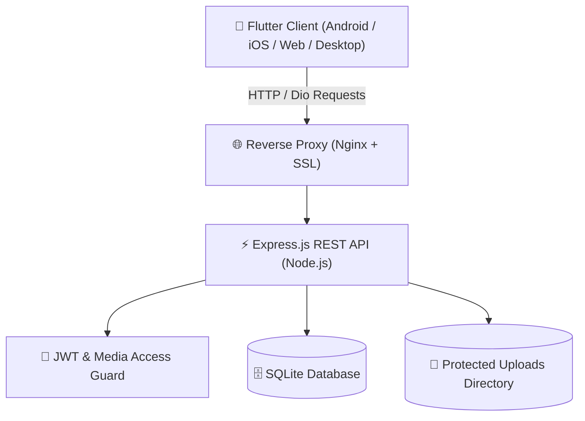

# 🦁 پلتفرم شبکه اجتماعی شیربراکس (ShirBrax)

> پلتفرم جامع و مدرن اشتراک‌گذاری عکس، ویدیو، استوری و محتوای اشتراکی با فلاتر (Flutter) و نود‌جی‌اس (Node.js).

---

## 📌 فهرست مطالب
- [معرفی پروژه](#-معرفی-پروژه)
- [ویژگی‌ها و قابلیت‌های کلیدی](#-ویژگیها-و-قابلیتهای-کلیدی)
- [معماری و پشته فناوری (Tech Stack)](#-معماری-و-پشته-فناوری-tech-stack)
- [ساختار پوشه‌بندی پروژه](#-ساختار-پوشهبندی-پروژه)
- [راهنمای سریع راه‌اندازی (Quick Start)](#-راهنمای-سریع-راهاندازی-quick-start)
- [مستندات تکمیلی و راهنماهای تخصصی](#-مستندات-تکمیلی-و-راهنماهای-تخصصی)
- [حساب‌های کاربری پیش‌فرض تستی](#-حسابهای-کاربری-پیشفرض-تستی)
- [لایسنس](#-لایسنس)

---

## 📖 معرفی پروژه

**شیربراکس (ShirBrax)** یک پلتفرم شبکه اجتماعی نسل جدید است که با تمرکز بر تعامل امن میان کاربران و سازندگان محتوا توسعه داده شده است. این سامانه علاوه بر ویژگی‌های مرسوم شبکه‌های اجتماعی (پست، استوری، لایک، کامنت، فالو، پروفایل)، دارای سیستم **کسب درآمد و فروش اشتراک ماهانه (Monetization)** و **کنترل دسترسی دو لایه** به رسانه‌هاست.

---

## ✨ ویژگی‌ها و قابلیت‌های کلیدی

### 🔐 ۱. احراز هویت و مدیریت کاربران
- ثبت‌نام، ورود ایمن و مدیریت نشست‌ها با **JWT** و رمزنگاری کلمات عبور با **bcrypt**.
- پروفایل اختصاصی با امکان تغییر نام، بیوگرافی و آواتار.
- حساب‌های کاربری عمومی (Public) و خصوصی (Private) همراه با سیستم **تایید/رد درخواست فالو (Follow Requests)**.

### 📸 ۲. پست‌ها و فید هوشمند
- ارسال پست‌های چندرسانه‌ای (عکس و ویدیو) با فشرده‌سازی و بارگذاری بهینه.
- فید بر اساس الگوریتم هوشمند دسترسی (عمومی، فالوئرها، مشترکین).
- سیستم تعاملی کامل: لایک/آن‌لایک پست، ارسال دیدگاه، پاسخ به دیدگاه‌ها و لایک دیدگاه‌ها.
- صفحه کاوش (Explore) برای مشاهده پست‌های برتر و جستجوی کاربران.

### 🔒 ۳. دروازه دو لایه حریم خصوصی و امنیت رسانه‌ها
1. **دروازه حساب (Account Gate):** در حساب‌های خصوصی، دسترسی به پست‌ها فقط برای دنبال‌کنندگان تاییدشده مجاز است.
2. **دروازه پست (Post Gate):** هر پست دارای سطح دسترسی اختصاصی است:
   - `public`: عمومی
   - `followers`: فقط فالوئرها
   - `subscribers`: فقط مشترکین پولی
- **تیزر قفل‌شده (Locked Teaser):** کاربران بدون اشتراک، پست‌های ویژه را به صورت قفل‌شده همراه با کاور مات و دکمه خرید اشتراک مشاهده می‌کنند.
- **محافظت مستقیم فایل‌ها (`/uploads`):** دسترسی به فایل‌های چندرسانه‌ای در سطح سرور با هدر `Authorization` کنترل می‌شود تا از نشت لینک‌های مستقیم جلوگیری شود.

### 💳 ۴. سیستم کسب درآمد و اشتراک ماهانه (Subscriptions)
- سازندگان محتوا می‌توانند قیمت اشتراک ماهانه خود را تعیین کنند.
- خرید، تمدید، استعلام و لغو اشتراک‌ها.
- آماده‌سازی شده جهت اتصال به درگاه‌های پرداخت بانکی (زرین‌پال، آیدی‌پی و...).

### ⏱️ ۵. استوری‌های ۲۴ ساعته
- ارسال استوری‌های تصویری و ویدیویی با انقضای خودکار پس از ۲۴ ساعت.
- تفکیک نمایش استوری بر اساس وضعیت دسترسی و دنبال‌کردن کاربر.

### 👑 ۶. پنل مدیریت جامع (Admin Panel)
- داشبورد آماری لحظه‌ای (تعداد کاربران، پست‌ها، ویدیوها و لایک‌ها).
- لیست کامل کاربران با امکان **مسدودسازی (Ban)** و رفع مسدودیت.
- مدیریت و حذف مستقیم پست‌های نامناسب توسط ادمین.

---

## 🛠 معماری و پشته فناوری (Tech Stack)



### بخش فرانت‌اند (کلاینت فلاتر):
- **فریم‌ورک:** Flutter (Dart 3.x)
- **مدیریت وضعیت (State Management):** GetX
- **مسیریابی (Routing):** GoRouter
- **ارتباطات شبکه (Networking):** Dio
- **ذخیره‌سازی محلی:** GetStorage
- **پخش رسانه:** `cached_network_image`, `video_player`, `chewie`, `photo_view`
- **طراحی و انیمیشن:** `flutter_animate`, `shimmer`, `google_fonts`

### بخش بک‌اند (سرور REST API):
- **محیط اجرا:** Node.js (ES Modules)
- **فریم‌ورک وب:** Express.js
- **پایگاه داده:** SQLite3 (سبک، پرسرعت، بدون نیاز به سرویس خارجی)
- **احراز هویت و رمزنگاری:** `jsonwebtoken`, `bcryptjs`
- **مدیریت آپلود:** `multer` همراه با Middleware کنترل دسترسی `mediaAccess`

---

## 📂 ساختار پوشه‌بندی پروژه

```text
shirbrax/
├── backend/                   # 🖥️ سرور بک‌اند (Node.js & Express)
│   ├── data/                  # دیتابیس SQLite
│   ├── src/                   # کدهای اصلی بک‌اند
│   │   ├── config/            # اتصالات دیتابیس و متغیرها
│   │   ├── middleware/        # احراز هویت، گارد دسترسی رسانه و آپلود
│   │   ├── routes/            # اندپوینت‌های REST API
│   │   ├── services/          # سرویس‌ها و Seeder دیتابیس
│   │   └── utils/             # منطق دسترسی، پاسخ‌ها و هلپرها
│   ├── uploads/               # رسانه‌های آپلودشده محافظت‌شده
│   ├── .env                   # متغیرهای محیطی
│   ├── package.json           # وابستگی‌های Node.js
│   ├── README.md              # مستندات تخصصی بک‌اند
│   └── test_all_apis.js       # اسکریپت تست خودکار APIها
│
├── lib/                       # 📱 کلاینت فلاتر (Flutter Client)
│   ├── app/                   # پیکربندی روت‌ها، تم و چرخه حیات
│   ├── core/                  # ارتباطات شبکه، اینترسپتورها، بایندینگ‌ها و استوریج
│   ├── data/                  # مدل‌ها، پرووایدرها و ریپازیتوری‌ها
│   ├── features/              # ماژول‌های برنامه (Auth, Home, Explore, Story, ...)
│   ├── shared/                # ویجت‌های مشترک، دیالوگ‌ها و لایه‌ها
│   └── main.dart              # نقطه ورود کلاینت
│
├── docs/                      # 📚 مستندات تخصصی و جامع
│   ├── API_REFERENCE.md       # کاتالوگ دقیق و کامل کلیه اندپوینت‌ها
│   ├── FLUTTER_GUIDE.md       # راهنمای معماری، اجرا و بیلد کلاینت
│   └── DEPLOYMENT_GUIDE.md    # راهنمای استقرار در محیط واقعی (Production)
│
├── pubspec.yaml               # وابستگی‌های پروژه فلاتر
└── README.md                  # همین راهنما (مستندات اصلی)
```

---

## ⚡ راهنمای سریع راه‌اندازی (Quick Start)

### ۱. اجرای بک‌اند (Node.js)

```bash
# ورود به پوشه بک‌اند
cd backend

# نصب وابستگی‌ها
npm install

# اجرای سرور در حالت توسعه
npm run dev
```
> سرور روی پورت `3000` اجرا شده و دیتابیس با داده‌های تستی اولیه مقداردهی می‌شود.

برای تست صحت عملکرد APIها:
```bash
node test_all_apis.js
```

---

### ۲. اجرای اپلیکیشن فلاتر (Flutter)

۱. در فایل `lib/core/network/api_endpoints.dart` بر اساس دستگاه تستی خود، آدرس سرور را مشخص کنید:
- شبیه‌ساز اندروید: `http://10.0.2.2:3000/api/v1`
- وب / دسکتاپ: `http://localhost:3000/api/v1`
- گوشی واقعی متصل به وای‌فای: `http://<YOUR_LOCAL_IP>:3000/api/v1`

۲. اجرای اپلیکیشن:
```bash
flutter pub get
flutter run
```

---

## 🔑 حساب‌های کاربری پیش‌فرض تستی

| نام کاربری | ایمیل | کلمه عبور | نقش / ویژگی |
|---|---|---|---|
| `admin` | `admin@shirbrax.ir` | `admin123456` | **مدیر کل سیستم (Admin)** |
| `ali_m` | `ali@example.com` | `123456` | کاربر دارای پست عمومی و فالوئر |
| `sara_a` | `sara@example.com` | `123456` | **فروشنده اشتراک** (دارای پست فقط مشترکین) |
| `maryam_h` | `maryam@example.com` | `123456` | **حساب خصوصی (Private)** |
| `reza_k` | `reza@example.com` | `123456` | کاربر دارای درخواست‌های فالوی معلق |

---

## 📚 مستندات تکمیلی و راهنماهای تخصصی

برای مطالعه جزئیات بیشتر در مورد هر بخش، به اسناد زیر مراجعه کنید:

1. [📖 راهنمای تخصصی سرور بک‌اند (backend/README.md)](backend/README.md)
2. [📡 کاتالوگ و مرجع کامل وب‌سرویس‌ها (docs/API_REFERENCE.md)](docs/API_REFERENCE.md)
3. [📱 راهنمای معماری و توسعه کلاینت فلاتر (docs/FLUTTER_GUIDE.md)](docs/FLUTTER_GUIDE.md)
4. [🚀 راهنمای استقرار در سرور عملیاتی (docs/DEPLOYMENT_GUIDE.md)](docs/DEPLOYMENT_GUIDE.md)

---

## 📄 لایسنس

این پروژه تحت مجوز [MIT](LICENSE) منتشر شده است.
