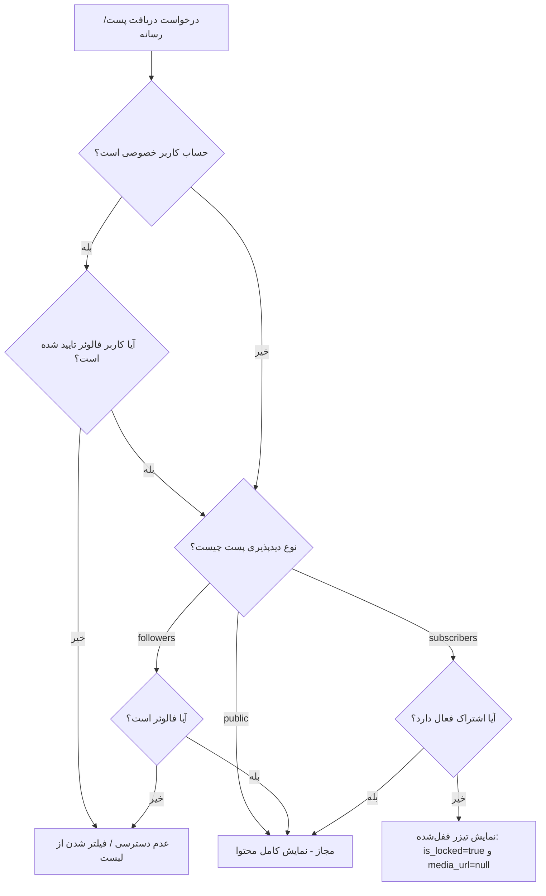

# 🖥️ راهنمای سرور بک‌ند شیربراکس (ShirBrax Backend)

این پکیج، هسته پردازشی و سرور وب‌سرویس‌های پلتفرم شبکه اجتماعی **شیربراکس** است که با معماری ماژولار و بر پایه **Node.js (ES Modules)**، فریم‌ورک **Express** و پایگاه داده سبک و پرسرعت **SQLite** طراحی شده است.

---

## 📌 فهرست مطالب
- [پشته فناوری و معماری](#-پشته-فناوری-و-معماری)
- [ساختار پوشه‌بندی بک‌اند](#-ساختار-پوشهبندی-بکاند)
- [پیکربندی متغیرهای محیطی (.env)](#-پیکربندی-متغیرهای-محیطی-env)
- [راه‌اندازی در محیط توسعه و تست](#-راهاندازی-در-محیط-توسعه-و-تست)
- [تست خودکار جامع APIها](#-تست-خودکار-جامع-apiها)
- [سیستم کنترل دسترسی و حریم خصوصی](#-سیستم-کنترل-دسترسی-و-حریم-خصوصی)
- [حساب‌های کاربری پیش‌فرض (Seeded Data)](#-حسابهای-کاربری-پیشفرض-seeded-data)
- [فهرست خلاصه مسیرهای API](#-فهرست-خلاصه-مسیرهای-api)
- [راهنمای استقرار در پروداکشن](#-راهنمای-استقرار-در-پروداکشن)

---

## 🛠 پشته فناوری و معماری

- **محیط اجرا:** Node.js (نسخه ۱۸ به بالا با پشتیبانی پیش‌فرض از ES Modules)
- **فریم‌ورک وب:** Express.js 4.x
- **پایگاه داده:** SQLite3 (ذخیره‌سازی لوکال در `data/database.sqlite` بدون نیاز به نصب سرویس مجزا)
- **احراز هویت:** JWT (JSON Web Tokens) همراه با هشینگ رمزعبور با `bcryptjs`
- **مدیریت آپلود:** `multer` همراه با سیستم کنترل مجوز دسترسی فایل (`mediaAccess`)
- **سرویس‌ها:** پشتیبانی از تعاملات، خرید اشتراک، استوری ۲۴ ساعته و سیستم نوتیفیکیشن

---

## 📂 ساختار پوشه‌بندی بک‌اند

```text
backend/
├── data/                      # مسیر ذخیره فایل دیتابیس SQLite
│   └── database.sqlite
├── uploads/                   # فایل‌های عکس/ویدیو آپلودشده محافظت‌شده
├── src/
│   ├── config/                # اتصال دیتابیس و تعریف ساختار جداول اولیه
│   │   └── database.js
│   ├── middleware/            # میان‌افزارهای احراز هویت، اعتبارسنجی و دسترسی رسانه
│   │   ├── auth.js            # گارد احراز هویت توکن JWT و نقش ادمین
│   │   ├── mediaAccess.js     # گارد بررسی دسترسی مستقیم به فایل‌های آپلودی
│   │   └── upload.js          # کانفیگ Multer برای آپلود فایل‌های مدیا
│   ├── routes/                # مسیرها و کنترلرهای REST API
│   │   ├── admin.routes.js    # مدیریت کاربران و پست‌ها توسط ادمین
│   │   ├── auth.routes.js     # ثبت‌نام، ورود، رفرش و اطلاعات کاربر جاری
│   │   ├── notifs.routes.js   # لیست اعلان‌ها و وضعیت خوانده‌شدن
│   │   ├── posts.routes.js    # فید، اکسپلور، آپلود، کامنت و لایک
│   │   ├── stories.routes.js  # استوری‌های ۲۴ ساعته
│   │   └── users.routes.js    # پروفایل، فالو، حریم خصوصی و خرید اشتراک
│   ├── services/              # سرویس‌های منطق بیزنس و Seed اولیه
│   │   └── seedService.js     # مقداردهی اولیه کاربران، پست‌ها و روابط تستی
│   ├── utils/                 # توابع کمکی، پاسخ‌های استاندارد و لاجیک دسترسی
│   │   ├── access.js          # منطق متمرکز بررسی دسترسی به پست‌ها و رسانه
│   │   └── response.js        # قالب‌بندی استاندارد خروجی‌های JSON
│   ├── app.js                 # پیکربندی اکسپرس، میان‌افزارها و روت‌ها
│   └── server.js              # نقطه شروع اجرای سرور روی پورت انتخابی
├── .env                       # متغیرهای پیکربندی محیطی
├── package.json               # اسکریپت‌ها و وابستگی‌های پکیج
└── test_all_apis.js           # اسکریپت تست صحت عملکرد تمامی اندپوینت‌ها
```

---

## ⚙️ پیکربندی متغیرهای محیطی (.env)

فایل `.env` در ریشه پوشه `backend` قرار دارد:

```env
PORT=3000
JWT_SECRET=shirbrax_super_secret_jwt_key_2026_change_in_production
JWT_EXPIRES_IN=30d
NODE_ENV=development
BASE_URL=http://localhost:3000
```

> ⚠️ **نکته امنیتی:** در محیط عملیاتی (Production)، حتماً مقدار `JWT_SECRET` را با یک رشته طولانی و تصادفی تغییر دهید.

---

## 🚀 راه‌اندازی در محیط توسعه و تست

### ۱. نصب وابستگی‌ها
```bash
cd backend
npm install
```

### ۲. اجرای سرور
برای اجرای مستقیم:
```bash
npm start
```

برای اجرای در حالت توسعه (با راه‌اندازی مجدد خودکار در صورت تغییر کد با `--watch`):
```bash
npm run dev
```

> 💡 با اولین اجرا، جداول دیتابیس به صورت خودکار ایجاد شده و داده‌های اولیه تستی توسط `seedService.js` بارگذاری می‌شوند.

---

## 🧪 تست خودکار جامع APIها

جهت اطمینان از عملکرد صحیح تمامی وب‌سرویس‌ها، کنترل دسترسی‌ها، خرید اشتراک و پنل ادمین، دستور زیر را اجرا کنید:

```bash
node test_all_apis.js
```

این اسکریپت بیش از ۲۰ سناریوی واقعی را اجرا کرده و گزارش موفقیت/خطا را نمایش می‌دهد.

---

## 🔒 سیستم کنترل دسترسی و حریم خصوصی

دسترسی به محتوای هر پست از **دو دروازه متوالی** عبور می‌کند:



### محافظت از فایل‌های رسانه (`/uploads`)
- مسیر فایل‌های رسانه توسط میان‌افزار `src/middleware/mediaAccess.js` محافظت می‌شود.
- کاربران بدون هدر احراز هویت معتبر و بدون دسترسی فعال به صاحب پست، پاسخ `403 Forbidden` دریافت می‌کنند.
- آواتار کاربران عمومی است تا در لیست‌ها و جستجوها بدون مشکل بارگذاری شود.

---

## 🔑 حساب‌های کاربری پیش‌فرض (Seeded Data)

| نقش / وضعیت | ایمیل | کلمه عبور | نام کاربری | توضیحات و دسترسی |
|---|---|---|---|---|
| **مدیر کل (Admin)** | `admin@shirbrax.ir` | `admin123456` | `admin` | دسترسی کامل به پنل ادمین، آمار، بن کردن و حذف پست‌ها |
| **کاربر دارای پست فالوئر** | `ali@example.com` | `123456` | `ali_m` | دارای پست با دسترسی `followers` |
| **فروشنده اشتراک** | `sara@example.com` | `123456` | `sara_a` | فروشنده اشتراک (۵۰,۰۰۰ تومان) + پست قفل‌شده مشترکین |
| **حساب خصوصی** | `maryam@example.com` | `123456` | `maryam_h` | حساب خصوصی (نیازمند تایید درخواست فالو) |
| **کاربر عادی** | `reza@example.com` | `123456` | `reza_k` | دارای درخواست فالوی در انتظار تایید برای `maryam_h` |

---

## 📡 فهرست خلاصه مسیرهای API

برای مشاهده جزئیات دقیق بدنه درخواست‌ها، پارامترها و پاسخ‌های JSON، به [مستندات جامع APIها](../docs/API_REFERENCE.md) مراجعه فرمایید.

- **احراز هویت (`/api/v1/auth`):**
  - `POST /register` | `POST /login` | `GET /me` | `POST /refresh` | `POST /logout`
- **پست‌ها و تعاملات (`/api/v1/posts`):**
  - `GET /` | `GET /explore` | `GET /:id` | `POST /upload` | `DELETE /:id` | `POST /:id/like`
  - `GET /:id/comments` | `POST /:id/comments` | `POST /:id/comments/:commentId/like`
- **کاربران، حریم خصوصی و اشتراک (`/api/v1/users`):**
  - `GET /` | `GET /:id` | `GET /:id/posts` | `POST /:id/follow` | `PUT /profile` | `PUT /privacy`
  - `GET /follow-requests` | `POST /follow-requests/:followerId/accept` | `POST /follow-requests/:followerId/reject`
  - `GET /:id/subscription` | `POST /:id/subscribe` | `DELETE /:id/subscribe`
- **استوری‌ها و اعلان‌ها:**
  - `GET /api/v1/stories` | `POST /api/v1/stories`
  - `GET /api/v1/notifications` | `PATCH /api/v1/notifications/:id/read` | `POST /api/v1/notifications/read-all`
- **مدیریت سامانه (`/api/v1/admin`):**
  - `GET /stats` | `GET /users` | `GET /posts` | `POST /users/:id/ban` | `DELETE /posts/:id`

---

## 🌐 راهنمای استقرار در پروداکشن

برای راه‌اندازی سرور بک‌اند در سرور لینوکس پروداکشن با **PM2** و **Nginx** همراه با گواهی SSL، لطفاً به [راهنمای جامع استقرار](../docs/DEPLOYMENT_GUIDE.md) مراجعه کنید.
